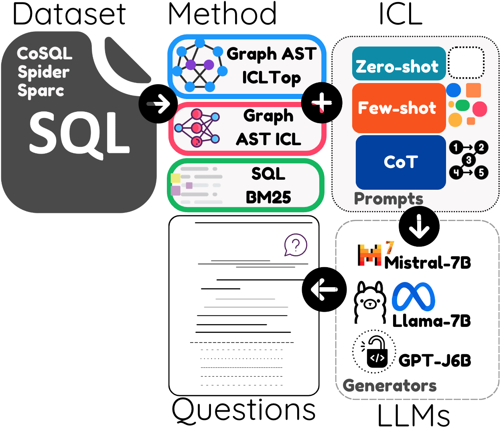

# Semantic Captioning
Benchmark Dataset and Graph-Aware Few-Shot In-Context Learning for SQL2Tex


## Running the code
```
python --dataset <cosql|spider|sparc> --method <icl-top|icl-cluster|random|BM25|zero> --lang_model <LANG_MODEL> --num_examples <number of demonstrations>
```


