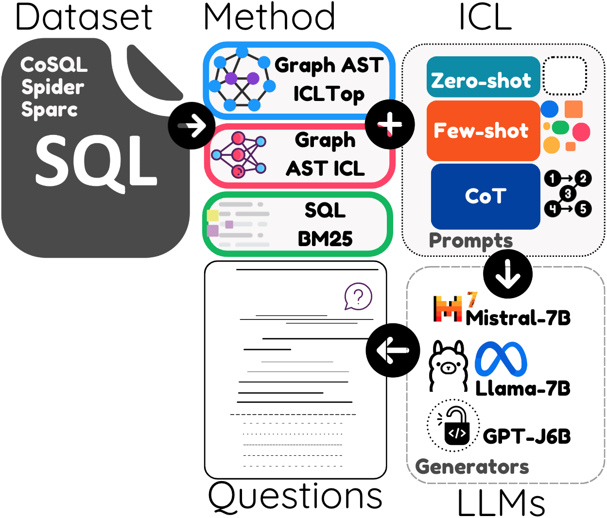

# Semantic Captioning
Benchmark Dataset and Graph-Aware Few-Shot In-Context Learning for SQL2Tex


## Train and create prompt file
```
python assemble.py --dataset <cosql|spider|sparc> --method <icl-top|icl-cluster|random|BM25|zero> --model <GCN|SAGE|GAT> --num_examples <number of demonstrations>
```
Input files will be created in the `./input` directory

## Prompt and Measure
```
accelerate launch --main_process_port <PORT>  --num_processes <NUM_GPUs> prompt.py --input_csv <assembed file path> --limit <how many prompts to run> --model_name <gpt-j-6b|mistral-7B|codellama-7b> 
```

Results will be logged in `EXPERIMENTS.txt` file


# ast-icl
